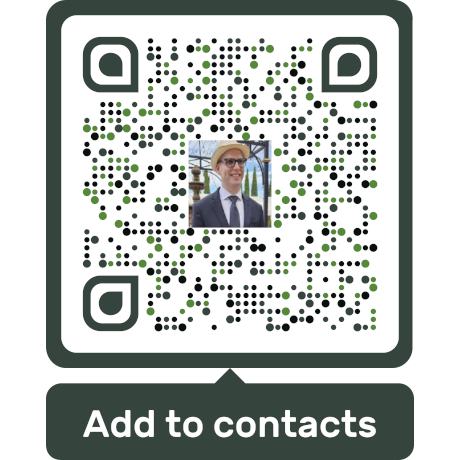

  

    

      
    

    

      
    

  

## About Me

I am a full-stack web developer specializing in custom web applications and APIs. I have extensive experience independently building complex web portals from scratch using HTML5, CSS, JavaScript, and jQuery. I am proficient in data management tools like SQL, JSON, and DataTables.

My forte is in fashioning intuitive, responsive, and cross-browser-compatible websites and user interfaces to meet my clients' exacting specifications. Working closely with backend engineers, I've built robust APIs from the ground up using technologies like Delphi DataSnap, including the automation of email responses, account creation, and payment processing. Further achievements extend to the independent development of internal web applications and interfaces for hardware systems. 

Development tools I have utilized include Embarcadero RAD Studio, Visual Studio Code, and GitHub (Git) for version control. I use Linux and Windows operating systems and tools with equal proficiency, and I harness AI technologies such as ChatGPT, Gemini, and Copilot to streamline workflows.

I possess a deep passion for learning, problem-solving, and taking initiative. I am dedicated to my mission, values, and the pursuit of a meaningful impact. I also strive to master soft skills and connecting with people on a personal level.

Outside of work, I enjoy hiking, weight training, baking, cooking, photography, drawing, listening to intellectual podcasts, solving complex problems, learning how things work, overcoming challenges through creativity and perseverance, and learning new technologies that help me improve as a developer. 

I'm a lefty and enjoy merging the intellectual with the artistic.

My passion is using my skills to create elegant solutions that meet the specific needs of my clients.

## Links

Email: [alex@rybicki.dev](mailto:alex@rybicki.dev)

LinkedIn: [https://www.linkedin.com/in/alex-rybicki](https://www.linkedin.com/in/alex-rybicki)

GitHub: [https://github.com/alexrybicki](https://github.com/alexrybicki)

Add me to your contacts with a vCard: [Scan](assets/alex-vcard.png) or [Download](assets/alex-vcard.vcf)
